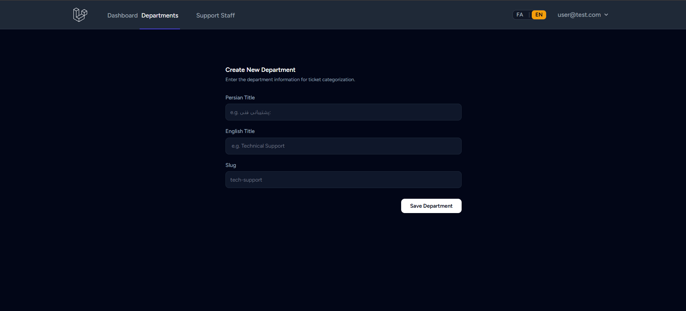
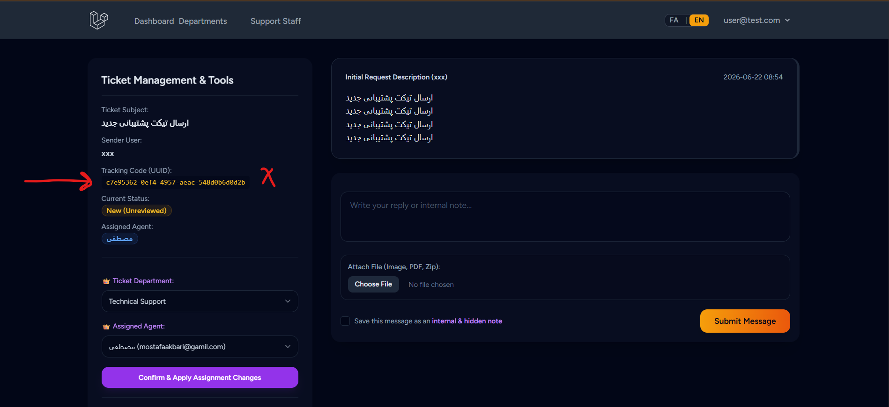

# 🎫 Chaman Ticket - Multi-Language Enterprise Ticketing & Support System

[](https://laravel.com)
[](https://php.net)
[](https://tailwindcss.com)
[](LICENSE)

An enterprise-grade, multi-language (Persian/English) customer support ticketing system built with **Laravel 13**, **Tailwind CSS**, and **Alpine.js**, featuring a clean, responsive, and role-based architecture. Designed to streamline client communications, department management, and internal ticket assignment with strict role-based authorization.

---

## 📌 1. Project Overview (معرفی کلی)

- **What it does:** Provides a centralized ticket management and communication platform for organizations to manage incoming client issues, route them to specialized support departments, and track issue resolution.
- **Main Goal:** Deliver a structured support automation system that simplifies workflows and bridges communication between clients, support agents, and system administrators.
- **Problems Solved:**
  - Eliminates disorganized support channels (emails/messengers).
  - Solves authorization issues through granular Role-Based Access Control (RBAC).
  - Improves ticket security through UUID-based ticket identification.
  - Provides seamless dynamic runtime localization (FA/EN).

---

## ✨ 2. Key Features (امکانات پروژه)

### 👤 User Panel (بخش کاربران عادی)

- **Ticket Lifecycle Management:** Submit new support tickets with department selection and track the progress of requests.
- **Interactive Messaging:** Reply to ongoing tickets, view conversation history, and track ticket status changes.
- **Personal Dashboard:** View active, answered, and total ticket metrics along with recent support activity.

### 🛡️ Support Agent Panel (بخش کارشناسان پشتیبانی)

- **Department-Bound Queues:** View tickets related to assigned support departments.
- **Direct Assignment Queue:** Manage tickets directly assigned to the support agent.
- **Internal Confidential Notes:** Add internal notes visible only to admins and support agents.
- **Status Updates:** Change ticket statuses (`new`, `pending`, `answered`, `closed`).

### 👑 Super Admin Panel (بخش مدیر کل)

- **Global Visibility:** Access all tickets, metrics, and system activity across departments.
- **Department Management:** Full CRUD operations for support departments.
- **Agent Management:** Create, edit, and assign support agents to specific departments.
- **Manual Ticket Assignment:** Assign tickets directly to specific support agents.

### 🔑 Role Access Matrix (تفاوت دسترسی‌ها)

| Feature / Role                | User (Level 0) | Support Agent (Level 1) | Super Admin (Level 2) |
| :---------------------------- | :------------: | :---------------------: | :-------------------: |
| Create & Reply to Own Tickets |      ✅        |           ✅            |          ✅           |
| View Assigned Dept Tickets    |      ❌        |           ✅            |          ✅           |
| View Internal Notes           |      ❌        |           ✅            |          ✅           |
| Manage Departments & Agents   |      ❌        |           ❌            |          ✅           |
| Global Ticket Assignment      |      ❌        |           ❌            |          ✅           |

### 🔄 Ticketing & Identification Architecture

- **UUID Ticket Tracking:** Uses UUID-based ticket identification instead of predictable numeric IDs to provide secure ticket tracking and prevent unauthorized ticket guessing.
- **Department Routing:** Routes tickets to designated support departments for better workflow management.

---

## 🛠️ 3. Tech Stack (تکنولوژی‌ها)

- **PHP Version:** `8.3+`
- **Framework:** `Laravel 13`
- **Database:** `MySQL 8+`
- **Frontend Engine:** `Blade Templating`
- **CSS Framework:** `Tailwind CSS 3.x`
- **JavaScript:** `Alpine.js` / Vanilla JavaScript
- **Authentication Method:** `Laravel Breeze` (Session-based authentication)

- **Key Packages:**
  - `laravel/breeze` (Authentication scaffolding)
  - `guzzlehttp/guzzle` (HTTP client)

---

## 📁 4. Project Architecture & Structure (ساختار پروژه)

The project follows Laravel's MVC architecture with a clean and modular structure, making it easy to maintain and extend.

```text
app/
├── Console/
│   └── Commands/
│       └── MakeSuperAdmin.php
│
├── Http/
│   ├── Controllers/
│   │   ├── Admin/
│   │   │   ├── DepartmentController.php
│   │   ├── SupportManagementController.php
│   │   └── TicketController.php
│   │   ├── Auth/
│   │   │   └── ... Laravel Breeze controllers
│   │   ├── User/
│   │   │   ├── DashboardController.php
│   │   │   └── TicketController.php
│   │   ├── LanguageController.php
│   │   ├── ProfileController.php
│   │   └── WelcomeController.php
│   │
│   ├── Middleware/
│   │   ├── AdminAccess.php
│   │   └── SetLocale.php
│   │
│   └── Requests/
│       ├── ProfileUpdateRequest.php
│       └── Auth/
│           └── LoginRequest.php
│
├── Models/
│   ├── User.php
│   ├── Department.php
│   ├── Ticket.php
│   └── Reply.php
│
├── Services/
│   └── Notification/
│       ├── NotificationProviderInterface.php
│       ├── NotificationService.php
│       ├── EmailProvider.php
│       └── SmsProvider.php
│
├── Providers/
│   └── AppServiceProvider.php
│
└── View/
    └── Components/
        ├── AppLayout.php
        └── GuestLayout.php

database/
├── factories/
│   └── UserFactory.php
├── migrations/
└── seeders/
    └── DatabaseSeeder.php

routes/
├── web.php
├── auth.php
└── console.php
```

### Architecture Highlights

- **Laravel MVC Architecture** for a structured and maintainable application.
- **Role-Based Access Control (RBAC)** with User, Support Agent, and Super Admin roles.
- **UUID-based Ticket Identification** for secure ticket tracking.
- **Service Layer** using the Strategy Pattern for Email and SMS notification providers.
- **Localization Middleware** for dynamic Persian (FA) and English (EN) language switching.
- **Custom Artisan Command** for interactive Super Admin creation.

---

## 🚀 5. Installation & Setup

Follow the steps below to set up the project on your local machine.

### 📋 Prerequisites

Make sure the following software is installed:

- PHP >= 8.3
- Composer >= 2.0
- Node.js >= 18
- NPM >= 9
- MySQL >= 8.0 (or MariaDB)

---

### 1. Clone the Repository

```bash
git clone https://github.com/sepehrwordpres/saas-ticket-system.git
cd saas-ticket-system
```

---

### 2. Install PHP Dependencies

```bash
composer install
```

---

### 3. Install Frontend Dependencies

```bash
npm install
```

For development:

```bash
npm run dev
```

For a production build:

```bash
npm run build
```

---

### 4. Configure Environment

Copy the example environment file.

**Linux / macOS**

```bash
cp .env.example .env
```

**Windows (CMD)**

```cmd
copy .env.example .env
```

Then edit your `.env` file:

```env
APP_NAME="Chaman Ticket"
APP_URL=http://127.0.0.1:8000

DB_CONNECTION=mysql
DB_HOST=127.0.0.1
DB_PORT=3306
DB_DATABASE=chaman_ticket
DB_USERNAME=root
DB_PASSWORD=
```

---

### 5. Generate the Application Key

```bash
php artisan key:generate
```

---

### 6. Run Database Migrations

```bash
php artisan migrate
```

---

### 7. Create the First Super Admin

Run the interactive Artisan command:

```bash
php artisan make:super-admin
```

Then follow the terminal prompts to enter:

- Name
- Email
- Password

---

### 8. Start the Development Server

```bash
php artisan serve
```

Open your browser and navigate to:

```text
http://127.0.0.1:8000
```

---

## 📷 6. Screenshots

Screenshots of the main application interfaces can be added here.

### User Dashboard


### Support Agent Panel


### Super Admin Panel


### Ticket Conversation


### Department Management



## 👥 Expert Management


## 🎫 Admin Ticket Conversation


---

## 🛡️ 7. Security Features

- **UUID Ticket Identification** – Uses UUIDs for secure ticket tracking and prevents predictable ticket URLs.
- **Role-Based Authorization** – Three authorization levels:
  - User (Level 0)
  - Support Agent (Level 1)
  - Super Admin (Level 2)
- **CSRF Protection** – Laravel's built-in protection against Cross-Site Request Forgery.
- **XSS Protection** – Automatic output escaping using Blade templates.
- **Request Validation** – Server-side validation for all important user inputs.
- **Session-based Authentication** – Powered by Laravel Breeze.

---

## ⭐ 8. Project Highlights

- 🌍 Multi-language support (Persian / English)
- 🎫 UUID-based secure ticket tracking
- 👥 Role-Based Access Control (RBAC)
- 🏢 Department-based ticket routing
- 💬 Interactive ticket conversation system
- 📎 File attachment support
- 📝 Internal staff notes (hidden from end users)
- ⚙️ Custom Artisan command for Super Admin creation
- 🔔 Pluggable Notification System (Email & SMS Strategy Pattern)
- 🌐 Dynamic language switching (FA / EN)
- 🧩 Modular Service Layer architecture
- 🎨 Modern responsive UI built with Tailwind CSS & Alpine.js

---

## 📌 9. Future Improvements

Planned features for future versions:

- REST API
- Asynchronous Email Notifications
- Real-time messaging using WebSockets
- Docker support
- Automated testing (Unit & Feature Tests)
- Advanced reporting & analytics
- Dark mode
- Notification center
- Email queue support
- API authentication (Laravel Sanctum)
